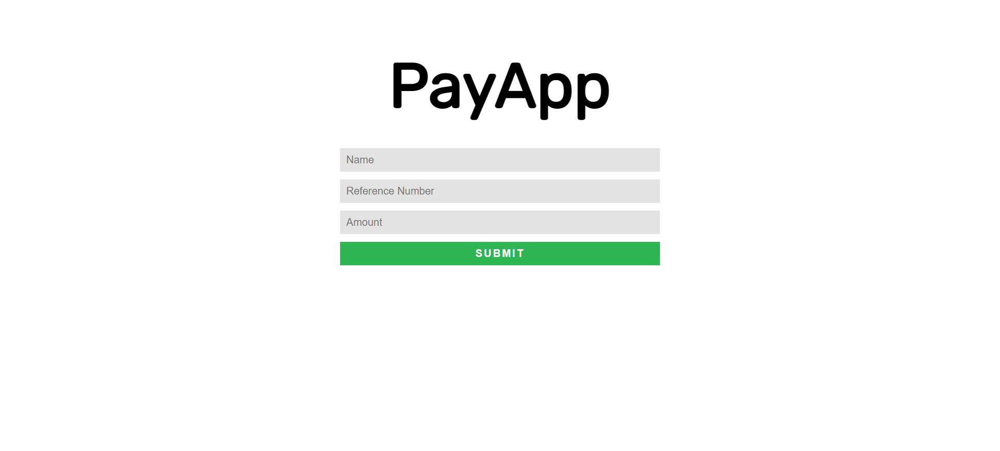

# ccapdev-mc03
Mini Challenge 3 for CCAPDEV2021T2

## General Instructions
- **READ THE INSTRUCTIONS FIRST BEFORE PROCEEDING!**
- You are provided with a skeleton code for this Mini-Challenge. You are **NOT ALLOWED** to modify any part of the code unless specified. Editable parts of code are marked with `TODO` comments.
- For any clarifications, ask your instructor.

## Local Set Up
- Make sure MongoDB is installed and running.
- Run `npm install` after [downloading the repository](https://github.com/arvention/ccapdev-2021t2-mc03/archive/refs/heads/main.zip).
- To run the application, execute `node index.js`

## Submission Details
- Place all necessary files in a zip file.
- **Do not include the `node_modules` folder**
- Submit the zip file via AnimoSpace.

## Content
- [controllers](controllers) - This folder contains files which defines callback functions for client requests.
- [models](models) - This folder contains files for database modeling and access.
- [public](public) - This folder contains static assets such as css, js, and image files.
- [routes](routes) - This folder contains files which describes the response of the server for each HTTP method request to a specific path in the server.
- [views](views) - This folder contains all hbs files to be rendered when requested from the server.
- [index.js](index.js) - The main entry point of the web application.

## Challenge Description
You are to create a web application which simulates an online payment transaction tracker.

When a client requests for the root path, i.e. `/`, the server should display [`views/index.hbs`](views/index.hbs). Your web browser should display the screen below:

## References
Maximize the materials uploaded for class and the resources readily available on the internet.

* [ccapdev-ajax](https://github.com/arvention/ccapdev-ajax) code sample
* [ccapdev-mongoose](https://github.com/arvention/ccapdev-mongoose) code sample
